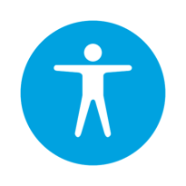

**UBKAccessibilityKit  by UBank**

A framework to help with accessibility development and testing.

[Report Bug](https://github.com/NAB/UBKAccessibilityKit/issues) ·  [Request Feature](https://github.com/NAB/UBKAccessibilityKit/issues) 


## Table of Contents
* [Features](#features)
* [About the Project](#about-the-project)
* [Getting Started](#getting-started)
    * [Installation](#installation)
* [Usage](#usage)
* [Contributing](#contributing)
* [Release History](#release-history)
* [License](#license)
* [Known bugs](#known-bugs)


## Features
UBKAccessibilityKit allows you to audit your iOS app on device, removing the need to stop and inspect each element via Xcode. UBKAccessibilityKit can be added to your exisiting project and includes the following features.

* Change text, tint and background colours live in app.
* Warnings & Validations
* Check colour contrast on text, tint and background colours
* Add in custom colours using the colour hex code.
* Swap foreground (Text & tint) colour with the background colour.
* Brand colours;
* Minimum size
* Missing accessibility label
* Missing accessibility traits
* Missing accessibility hints
* Missing accessibility value
* Missing isAccessibilityElement
* Dynamic text sizes supported
* Show touch points on screen, handy for when you're doing presentations or recording a video and want to show touches and swipes on screen.
* Highlight warnings as they are detected using the "Outline warnings" feature

**Custom the foreground or background colours.**
[Custom the foreground or background colours.](images/UBKAccessibility_change_colour_low.gif)

  

## About The Project
UBKAccessibilityKit was built as an internal testing tool for the iOS apps team at UBank (AUS). The team weren't happy with the tools available on the market as they had limited feature sets or didn't work as intended. UBKAccessibilityKit was originally built to help solve one problem but grew, based on many feature requests, into the current tool.

We built this because:
* Testing for accessibility can be a very time consuming process. Making the process easier means your time can be focused on creating amazing products.
* Finding and fixing Accessibility problems is a team task, not just for the testers on a project.
* We care deeply about Accessibility and think everyone should :smile:


  

## Getting Started

UBKAccessibilityKit requires Xcode 11.0 or higher, and an app deployment target of iOS 11.0 or higher.
This is an example of how you may give instructions on setting up your project locally.
To get a local copy up and running follow these example steps.

### Installation

AppDelegate:

In your AppDelegate.m add the following code.

```sh
//Objective-C usage
#import "UBKAccessibilityWindow.h"

- (UBKAccessibilityWindow *)window
{
    static UBKAccessibilityWindow *customWindow = nil;
    if (!customWindow)
    {
        customWindow = [[UBKAccessibilityWindow alloc] initWithFrame:[[UIScreen mainScreen] bounds]];
    }
    
    //This flag turns the inspector on or off. This could be used if you want to add a switch in the settings.app for your app.
    customWindow.enableInspector = TRUE;

    return customWindow;
}
```

or in your AppDelegate.swift file add the following code.
```
//Swift usage
import UBKAccessibilityKit

var customWindow: UBKAccessibilityWindow?
var window: UIWindow? {
    get {
        customWindow = customWindow ?? UBKAccessibilityWindow(frame: UIScreen.main.bounds)
        customWindow!.enableInspector = true
        return customWindow
    }
    set { }
} 
```

 
## Usage
**NOTE: It's not advised to include this framework in your production build, Apple will most likely reject your app.** 

Build and run. A floating Accessibility button will appear above the main window of the app. Tap this button to activate the Inspector. Select a UI component such as a label, button etc to see Accessibility information for the component.

A Sample project is included in this repo so you can see the framework working with a collection of standard UIKit components.

### Custom UI Components
If you have custom UI Components and want to take advantage of this framework, ensure the components conform to the UIViewAccessibilityProtocol.


### Colour Contast
Colour contrast is based on the below ratings.
Normal Text  (<24px or <18.66px and bold font)
```
AAA >= 7.0
AA >= 4.5
Fail < 4.5
```

  

Large Text (24px or 18.66px and bold font)
```
AAA Large >= 4.5
AA Large >= 3.0
Fail < 3.0
```

## Contributing
Contributions are what make the open source community such an amazing place to be learn, inspire, and create. Any contributions you make are **greatly appreciated**.

1. Fork the Project
2. Create your Feature Branch (`git checkout -b feature/AmazingFeature`)
3. Commit your Changes (`git commit -m 'Add some AmazingFeature'`)
4. Push to the Branch (`git push origin feature/AmazingFeature`)
5. Open a Pull Request


## Release History
* 1.0
    * The first public release

## License
Distributed under the Apache 2.0 License. See `LICENSE-2.0.txt` for more information.

## Known bugs

* Version 1.0 does not support VoiceOver on iOS 13. The current architecture prevents VoiceOver from interacting with Accessibility Inspector. We are investigating and fingers crossed it will be fixed in a future release.
